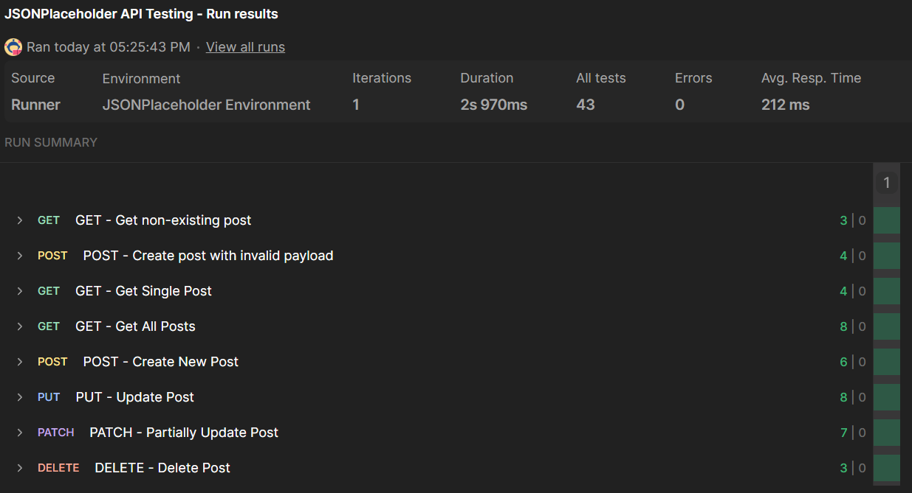

# JSONPlaceholder API Testing

## Project Overview

This module contains API tests created in Postman for the JSONPlaceholder REST API.

The project covers CRUD operations (GET, POST, PUT, PATCH and DELETE), including both
positive and negative test scenarios. The main goal was to practice REST API testing, request validation, response verification and Postman test automation using JavaScript.

## Technologies

- Postman
- Newman
- REST API
- JavaScript (Postman test scripts)
- JSON
- Git & GitHub

## Tested Endpoints

| Method | Endpoint | Description |
|--------|----------|-------------|
| GET | /posts | Get all posts |
| GET | /posts/{id} | Get a single post |
| POST | /posts | Create a new post |
| PUT | /posts/{id} | Update an existing post |
| PATCH | /posts/{id} | Partially update a post |
| DELETE | /posts/{id} | Delete a post |

## Test Scenarios

### Positive Tests

- Get all posts
- Get a single post
- Create a new post
- Update an existing post
- Partially update a post
- Delete a post

### Negative Tests

- Get a non-existing post
- Create a post with an invalid payload

## Environment Configuration

This collection uses Postman variables to make requests easier to maintain and reusable.

### Environment Variables

| Variable | Description |
|----------|-------------|
| `baseUrl` | Base URL of the JSONPlaceholder API |

Example:

```text
{{baseUrl}} = https://jsonplaceholder.typicode.com 
```

### Collection Variables

| Variable | Description |
|----------|-------------|
| `postId` | ID of the post used in requests |

## How to Run

### Run in Postman

1. Import `JSONPlaceholder_API_Testing.postman_collection.json`.
2. Import `JSONPlaceholder_Environment.postman_environment.json`.
3. Select the **JSONPlaceholder Environment**.
4. Open the collection and select **Run collection**.
5. Run all requests using the Collection Runner.

### Run with Newman

Newman requires Node.js and npm.

Install Newman globally:

```bash
npm install -g newman
```

From the main repository directory, run:

```bash
newman run ".\API\JSONPlaceholder_API_Testing.postman_collection.json" -e ".\API\JSONPlaceholder_Environment.postman_environment.json"
```

## Test Results

Final collection summary:

- Requests executed: **8**
- Automated assertions: **43**
- Failed requests: **0**
- Failed assertions: **0**
- Collection Runner: **43 / 43 assertions passed**

The collection was successfully executed both in Postman Collection Runner and from the command line using Newman.

### Collection Runner



## Known Limitations

JSONPlaceholder is a fake online REST API created for learning and testing purposes.

Some behaviors differ from real production APIs:

- Invalid request payloads are accepted instead of returning validation errors.
- POST, PUT, PATCH and DELETE requests do not permanently modify server data.
- Negative testing scenarios are limited by the behavior of the API.

## Repository Structure

```text
API
├── collection_runner_results.png
├── JSONPlaceholder_API_Testing.postman_collection.json
├── JSONPlaceholder_Environment.postman_environment.json
└── README.md
```

## Author

Created by Antoni Hawryło as part of a Manual QA portfolio project.
